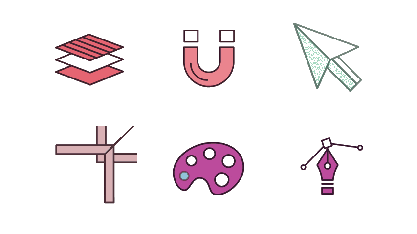

<h1 align="center">Aliyev Omar</h1>

<h2> About Me </h2>

- 🔭 I’m currently working on **DevOps Project**

- 🌱 I’m currently learning **Kubernetes**

- 👯 I’m looking to collaborate on **DevOps OpenSource Projects, Tech Articles**

- 💬 Talk to me about **AWS, DevOps, Automation, Freelancing Opportunites, Open Source**

   

  

<h2> Connect with me  </h2>

 

 

<!-- <h2> Skills  </h2> -->

<table style="width:100%">
  <tr>
    <th><h2> Skills </h2> </th>
    <th> </th>
  </tr>
  <tr>
    <td>  </td>
    <td>
       &nbsp;&nbsp;&nbsp;&nbsp;
      &nbsp;&nbsp;&nbsp;&nbsp;
      
    </td>
  </tr>
  <tr>
    <td>  </td>
    <td>
       &nbsp;&nbsp;&nbsp;&nbsp;
      
    </td>
  </tr>
    <tr>
    <td>  </td>
    <td>
       &nbsp;&nbsp;&nbsp;&nbsp;
       &nbsp;&nbsp;&nbsp;&nbsp;
      
    </td>
  </tr>
  <tr>
    <td>  </td>
    <td>
       &nbsp;&nbsp;&nbsp;&nbsp;
    </td>
  </tr>
  <tr>
    <td>  </td>
    <td>
       &nbsp;&nbsp;&nbsp;&nbsp;
       &nbsp;&nbsp;&nbsp;&nbsp;
       &nbsp;&nbsp;&nbsp;&nbsp;
       &nbsp;&nbsp;&nbsp;&nbsp;
       &nbsp;&nbsp;&nbsp;&nbsp;
       &nbsp;&nbsp;&nbsp;&nbsp;
       &nbsp;&nbsp;&nbsp;&nbsp;          
    </td>
  </tr>
  <tr>
    <td>  </td>
    <td>
       &nbsp;&nbsp;&nbsp;&nbsp;
       &nbsp;&nbsp;&nbsp;&nbsp;
       &nbsp;&nbsp;&nbsp;&nbsp;
       &nbsp;&nbsp;&nbsp;&nbsp;
       &nbsp;&nbsp;&nbsp;&nbsp;
    </td>
  </tr>
    <tr>
    <td>  </td>
    <td>
       &nbsp;&nbsp;&nbsp;&nbsp;
       &nbsp;&nbsp;&nbsp;&nbsp;
       &nbsp;&nbsp;&nbsp;&nbsp;
    </td>
  </tr>

</table>

